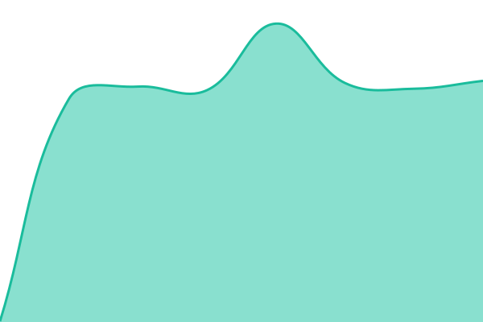
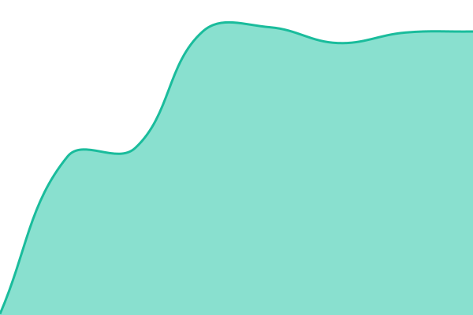
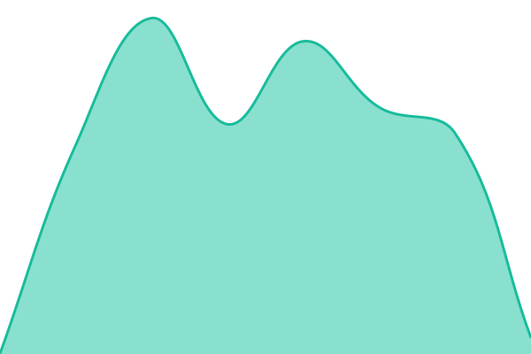
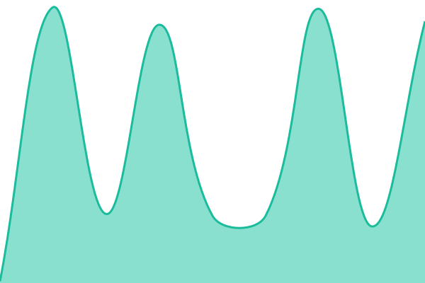
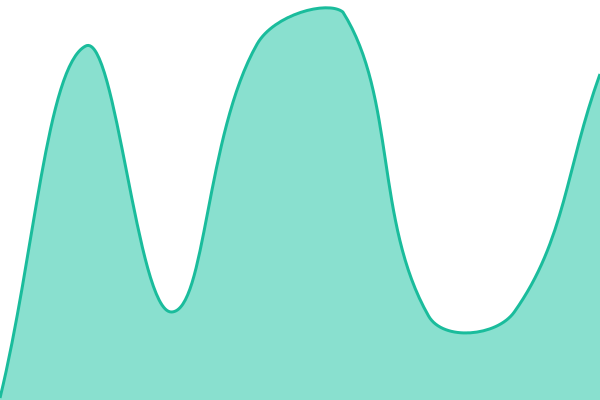
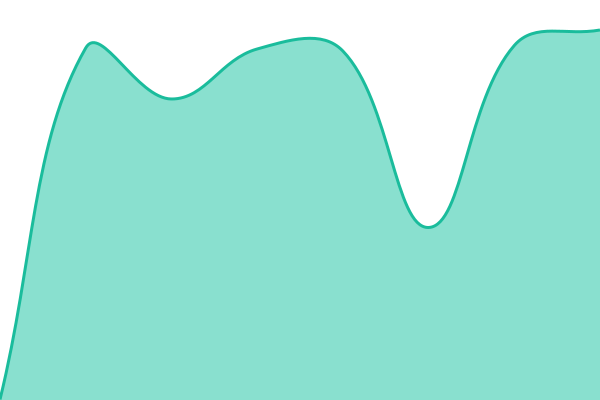

# [📈 Live Status](https://chans.bond): <!--live status--> **🟩 All systems operational**

This repository contains the open-source uptime monitor and status page for [chans-bond](https://chans.bond), powered by [Upptime](https://github.com/upptime/upptime).

With [Upptime](https://upptime.js.org), you can get your own unlimited and free uptime monitor and status page, powered entirely by a GitHub repository. We use [Issues](https://github.com/chans-bond/chans.bond/issues) as incident reports, [Actions](https://github.com/chans-bond/chans.bond/actions) as uptime monitors, and [Pages](https://chans.bond) for the status page.

<!--start: status pages-->
<!-- This summary is generated by Upptime (https://github.com/upptime/upptime) -->
<!-- Do not edit this manually, your changes will be overwritten -->
<!-- prettier-ignore -->
| URL | Status | History | Response Time | Uptime |
| --- | ------ | ------- | ------------- | ------ |
|  [1500chan](https://1500chan.org/) | 🟩 Up | [1500chan.yml](https://github.com/chans-bond/chans.bond/commits/HEAD/history/1500chan.yml) | 

 405ms
     
 | 

<a href="https://chans.bond/history/1500chan">100.00%</a>
    

|  [27chan](https://27chan.org/) | 🟩 Up | [27chan.yml](https://github.com/chans-bond/chans.bond/commits/HEAD/history/27chan.yml) | 

 309ms
     
 | 

<a href="https://chans.bond/history/27chan">96.61%</a>
    

|  [42chan](https://42chan.bond/) | 🟩 Up | [42chan.yml](https://github.com/chans-bond/chans.bond/commits/HEAD/history/42chan.yml) | 

 754ms
     
 | 

<a href="https://chans.bond/history/42chan">87.48%</a>
    

|  [83channel](https://83channel.net/) | 🟩 Up | [83channel.yml](https://github.com/chans-bond/chans.bond/commits/HEAD/history/83channel.yml) | 

 703ms
     
 | 

<a href="https://chans.bond/history/83channel">100.00%</a>
    

|  [Anões](https://anoes.net/) | 🟩 Up | [anoes.yml](https://github.com/chans-bond/chans.bond/commits/HEAD/history/anoes.yml) | 

 837ms
     
 | 

<a href="https://chans.bond/history/anoes">100.00%</a>
    

|  [BRCHAN](https://brchan.org/) | 🟩 Up | [brchan.yml](https://github.com/chans-bond/chans.bond/commits/HEAD/history/brchan.yml) | 

 663ms
     
 | 

<a href="https://chans.bond/history/brchan">96.63%</a>
    

|  [brchan.grok.me](https://brchanxaironsversions.grok.me/) | 🟩 Up | [brchan-grok-me.yml](https://github.com/chans-bond/chans.bond/commits/HEAD/history/brchan-grok-me.yml) | 

 1343ms
     
 | 

<a href="https://chans.bond/history/brchan-grok-me">100.00%</a>
    

|  [Goiaba](https://goiaba.bond/) | 🟩 Up | [goiaba.yml](https://github.com/chans-bond/chans.bond/commits/HEAD/history/goiaba.yml) | 

 77ms
     
 | 

<a href="https://chans.bond/history/goiaba">100.00%</a>
    

|  [Kekw](https://kekw.party/) | 🟩 Up | [kekw.yml](https://github.com/chans-bond/chans.bond/commits/HEAD/history/kekw.yml) | 

 91ms
     
 | 

<a href="https://chans.bond/history/kekw">100.00%</a>
    

|  [Magalichan](https://magalichan.com/) | 🟩 Up | [magalichan.yml](https://github.com/chans-bond/chans.bond/commits/HEAD/history/magalichan.yml) | 

 665ms
     
 | 

<a href="https://chans.bond/history/magalichan">100.00%</a>
    

|  [mokoichannel](https://mokoich.net/) | 🟩 Up | [mokoichannel.yml](https://github.com/chans-bond/chans.bond/commits/HEAD/history/mokoichannel.yml) | 

 621ms
     
 | 

<a href="https://chans.bond/history/mokoichannel">100.00%</a>
    

|  [SYNCH.PARTY](https://synch.party/b) | 🟩 Up | [synch-party.yml](https://github.com/chans-bond/chans.bond/commits/HEAD/history/synch-party.yml) | 

 716ms
     
 | 

<a href="https://chans.bond/history/synch-party">100.00%</a>
    

|  [Tchan](https://tchan.lol/) | 🟩 Up | [tchan.yml](https://github.com/chans-bond/chans.bond/commits/HEAD/history/tchan.yml) | 

 979ms
     
 | 

<a href="https://chans.bond/history/tchan">100.00%</a>
    

<!--end: status pages-->

[**Visit our status website →**](https://chans.bond)

## 📄 License

- Powered by: [Upptime](https://github.com/upptime/upptime)
- Code: [MIT](./LICENSE) © [Anand Chowdhary](https://anandchowdhary.com)
- Data in the `./history` directory: [Open Database License](https://opendatacommons.org/licenses/odbl/1-0/)
